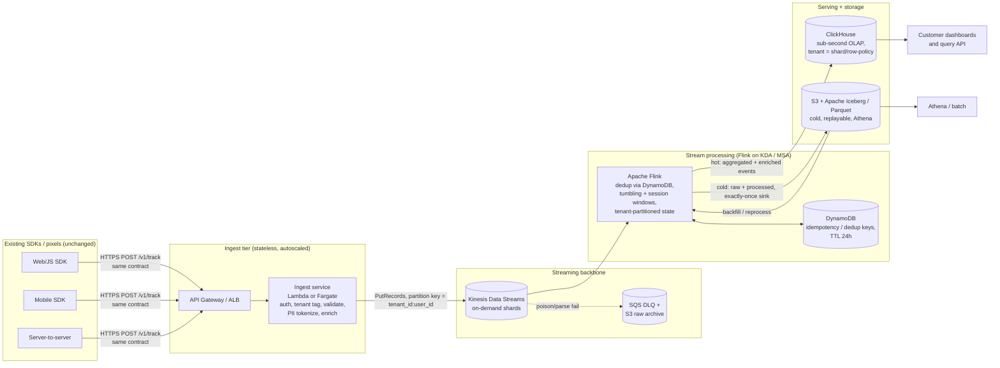

# Architecture

Deeper companion to the [strategy README](../README.md). Covers the data-flow
diagram, event schema, technology choices with rejected alternatives, and the
key control mechanisms (dedup, windowing, backpressure).

## 1. Data-flow diagram



Latency budget from client to queryable (target < 5s, see Evidence Log):

| Hop                                   | Budget      | Note |
| ------------------------------------- | ----------- | ---- |
| Client -> API Gateway/ALB -> ingest   | 50-150 ms   | TLS + auth + validate + tokenize |
| Ingest -> Kinesis `PutRecords`        | 20-80 ms    | batched put |
| Kinesis propagation -> Flink read     | 200-800 ms  | enhanced fan-out reduces this |
| Flink windowing + dedup + sink        | 0.5-2 s     | dominated by window emit cadence |
| ClickHouse insert -> queryable        | 0.2-1 s     | async insert + short flush interval |
| **End-to-end p99 target**             | **< 5 s**   | headroom retained |

## 2. Event schema

The ingest contract is **frozen and backwards-compatible**. Existing SDKs keep
sending the same payload. Server-side we normalize into a richer internal
envelope. New fields are additive and optional so no client change is required.

### 2.1 Wire payload (what the SDK sends today, unchanged)

```json
{
  "event": "page_view",
  "user_id": "u_8a3f...",
  "anonymous_id": "anon_51c...",
  "timestamp": "2026-06-24T10:15:32.104Z",
  "properties": {
    "url": "https://acme.example/pricing",
    "referrer": "google.com",
    "utm_campaign": "q2_launch"
  },
  "context": {
    "ip": "203.0.113.7",
    "user_agent": "Mozilla/5.0 ...",
    "library": "analytics.js/4.2.1"
  }
}
```

Tenant identity is derived server-side from the write key in the request header
(`Authorization: Bearer <write_key>`), never trusted from the body. This is why
no client change is needed to add tenancy.

### 2.2 Internal envelope (produced by the ingest service)

```json
{
  "schema_version": 3,
  "tenant_id": "t_00219",
  "event_id": "01J2Q7...ULID",
  "event_name": "page_view",
  "user_key": "usr_tok_9f21...",
  "anon_key": "anon_tok_4b0...",
  "event_ts": "2026-06-24T10:15:32.104Z",
  "ingest_ts": "2026-06-24T10:15:32.361Z",
  "geo": { "country": "CH", "region": "ZH" },
  "pii_class": "tokenized",
  "residency": "eu",
  "properties": { "url_host": "acme.example", "path": "/pricing", "utm_campaign": "q2_launch" },
  "dedup_key": "t_00219:01J2Q7...",
  "raw_ref": "s3://.../raw/2026/06/24/..."
}
```

### 2.3 Field table (internal envelope)

| Field            | Type      | Required | Purpose |
| ---------------- | --------- | -------- | ------- |
| `schema_version` | int       | yes      | Envelope evolution; additive changes only. |
| `tenant_id`      | string    | yes      | Multi-tenant partition key. Derived from write key, not body. |
| `event_id`       | ULID      | yes      | Globally unique; time-sortable; basis for idempotency. |
| `event_name`     | string    | yes      | The customer-defined event type. |
| `user_key`       | string    | no       | Tokenized user identifier (see PII handling). Reversible only via the token vault. |
| `anon_key`       | string    | no       | Tokenized anonymous id for pre-identify stitching. |
| `event_ts`       | RFC3339   | yes      | Event time (from client). Used for windowing + late-data handling. |
| `ingest_ts`      | RFC3339   | yes      | Processing time. `ingest_ts - event_ts` drives watermark/lateness. |
| `geo`            | object    | no       | Derived from IP at ingest, then IP is dropped (data minimization). |
| `pii_class`      | enum      | yes      | `none` / `tokenized` / `raw` (raw only in EU-resident vault path). |
| `residency`      | enum      | yes      | `eu` / `us`. Pins routing to a regional stream + store. |
| `properties`     | object    | no       | Sanitized event properties (raw IP/UA/email removed or tokenized). |
| `dedup_key`      | string    | yes      | `tenant_id:event_id`; checked against DynamoDB for at-least-once dedup. |
| `raw_ref`        | string    | no       | Pointer to immutable raw record in S3 for replay/audit. |

## 3. Technology choices

| Layer | Choice | Why | Alternatives rejected |
| ----- | ------ | --- | --------------------- |
| Edge / ingest API | **API Gateway (HTTP API) or ALB -> Lambda/Fargate** | Backwards-compatible endpoint; autoscales to spikes; per-tenant throttling and WAF; keeps the SDK contract frozen. | Direct-to-Kinesis from client (breaks the "no SDK change" rule and leaks tenancy); raw EC2 fleet (more ops for 2 engineers). |
| Streaming backbone | **Kinesis Data Streams (on-demand)** | Managed, no broker fleet to run with only 2 engineers; on-demand mode auto-scales shards for 10x spikes; native Flink + Lambda + Firehose integration; 24h-365d retention gives free replay. | **MSK/Kafka**: higher ceiling and cheaper at very large scale, but you operate brokers, partitions, and rebalancing. At 50M/day the ops tax is not justified for a 2-person team. Documented as the migration target if volume 10x's again. **SQS**: no ordered replayable log, no consumer fan-out for analytics. |
| Stream processing | **Apache Flink (Managed Service for Apache Flink / KDA)** | True event-time semantics, watermarks, tumbling + session windows, exactly-once sinks, keyed tenant state, checkpointing. Managed so the team owns jobs, not clusters. | **Spark Structured Streaming**: micro-batch adds seconds of latency, which fights the sub-5s goal; stronger for batch+stream unification we do not need here. **Kinesis Data Analytics SQL (legacy)**: too limited for multi-window multi-tenant logic. **Lambda-only**: fine for enrichment, no real windowed state across shards. |
| Dedup / idempotency state | **DynamoDB (conditional put, TTL 24h)** | Single-digit-ms lookups at scale; TTL auto-expires dedup keys; pay-per-request matches spiky load. Turns at-least-once delivery into effective exactly-once at the aggregate. | Redis/ElastiCache: another stateful thing to run and scale; Flink RocksDB state alone: fine within a job but weaker for cross-job / cross-restart idempotency guarantees. |
| Hot serving (OLAP) | **ClickHouse (self-managed on EC2 or ClickHouse Cloud)** | Sub-second aggregations on high-cardinality event data; excellent compression; async inserts fit streaming; per-tenant isolation via sharding + row policies; lowest cost-per-query of the three. | **Apache Pinot**: superb for user-facing sub-second concurrency, but heavier to operate (controllers/servers/brokers/deep-store) for 2 engineers. **Apache Druid**: strong time-series OLAP, but more moving parts and higher floor cost. ClickHouse gives the best ops/cost/latency balance at this scale; Pinot noted as the upgrade path if per-tenant concurrent QPS explodes. |
| Cold storage / lakehouse | **S3 + Apache Iceberg (Parquet), queried via Athena** | Cheap durable system of record; Iceberg gives schema evolution, time travel, and ACID compaction; enables full replay/backfill into Flink; Athena for ad-hoc/batch. | Redshift as primary store: expensive for raw retention and not needed given ClickHouse serves hot; plain Parquet without Iceberg: loses schema evolution and safe compaction. |
| Delivery semantics | **At-least-once transport + idempotent dedup = effective exactly-once at aggregates** | Kinesis/Flink give at-least-once cheaply; DynamoDB dedup + idempotent ClickHouse inserts (dedup on `event_id`) make counts correct without paying full exactly-once coordination cost end to end. | Strict end-to-end exactly-once: achievable with Flink two-phase-commit sinks but adds latency and operational fragility; documented as available for the small set of billing-grade metrics that need it. |

## 4. Key mechanisms

### 4.1 Sub-5s latency
- Enhanced fan-out on Kinesis so Flink reads with dedicated throughput and low
  propagation delay.
- Short Flink window emit cadence and low checkpoint interval; continuous or
  1-minute tumbling windows with early/incremental emission for dashboards.
- ClickHouse async inserts with a sub-second flush window so aggregates become
  queryable almost immediately.
- The [artifact](../artifact/pipeline_sim.py) demonstrates the queue+window+
  latency mechanics and holds p99 under 5s even when the processor is saturated.

### 4.2 10x spikes without data loss
- Kinesis on-demand auto-scales shards, with one honest caveat: on-demand
  doubles write capacity based on the trailing 30-day peak, so a cold
  instantaneous 10x spike can briefly throttle before it scales. The producer
  handles that with retry/backoff on `ProvisionedThroughputExceeded` and
  retention (24h+) as the durable buffer, so throttling becomes latency, not
  loss. At a sustained 5,800 eps of 1-2 KB records the stream sits well inside
  the on-demand ceiling; the spike is a burst, not the new baseline.
- Ingest tier is stateless and autoscaled (Lambda concurrency or Fargate target
  tracking).
- Bounded-buffer + backpressure at every stage; explicit, counted load-shedding
  (HTTP 429) only as a last resort, per-tenant so one noisy tenant cannot starve
  others. Both policies are demonstrated in the artifact.
- Poison/parse failures go to an SQS DLQ + S3 raw archive, never dropped
  silently.

### 4.3 Multi-tenancy + isolation
- `tenant_id` is the Kinesis partition key prefix and the ClickHouse
  shard/row-policy key.
- Per-tenant rate limits at the API tier and per-tenant Flink keyed state stop
  cross-tenant blast radius ("noisy neighbour").

### 4.4 GDPR / CCPA / SOC 2
- PII is tokenized at ingest; raw identifiers live only in a regional token
  vault. Analytics operate on tokens.
- Right-to-erasure in an append-only stream + Parquet + OLAP store is the hard
  part, so it is handled in two layers rather than glossed. (1) **Crypto-shred**:
  each subject's raw identifier is encrypted under a per-subject key held in the
  token vault; deleting that key makes the value unrecoverable at once. The
  tokenized `user_key` in the lake is still a stable pseudonym, and GDPR treats
  pseudonymous data as personal data, so key deletion alone is not full erasure.
  (2) **Purge the rows**: a scheduled job removes the subject's rows from
  ClickHouse (`ALTER TABLE ... DELETE` / lightweight deletes) and from Iceberg
  (row-level deletes materialized at the next compaction), keyed by `user_key`.
  Iceberg makes this tractable on Parquet that is otherwise immutable. Kinesis
  records expire via retention (<= 365d), which is disclosed to data subjects as
  the buffer window. Batching erasure requests keeps compaction cost bounded.
- Data residency: `residency` field pins EU traffic to eu-central-1 streams,
  Flink, ClickHouse, and S3; US traffic to us-east-1. No cross-region PII flow.
- SOC 2: encryption at rest (KMS) and in transit (TLS), audit trail via
  CloudTrail + immutable S3 raw log, least-privilege IAM per service.
